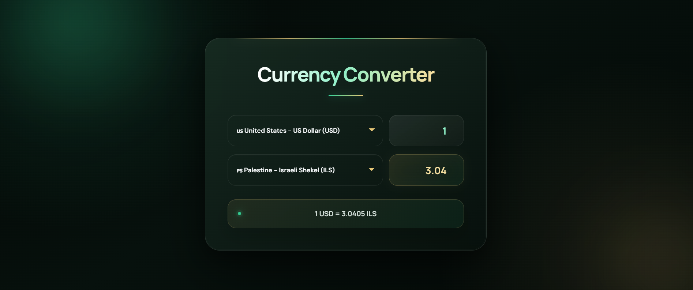

# 💱 Currency Converter

A modern, responsive, and professional **Currency Converter Web Application** that allows users to convert values between multiple international currencies using live exchange-rate data.

The project focuses on a clean financial-product interface, responsive design, and practical JavaScript functionality.

---

## ✨ Features

- 💱 Convert between multiple international currencies
- 🌍 Supports currencies from different countries
- 🔄 Dynamic currency conversion
- 📊 Displays the current exchange rate
- ⚡ Fast and lightweight
- 📱 Fully responsive design
- 🖥️ Optimized for desktop, tablet, and mobile
- 🎨 Modern premium UI
- 🧭 Custom currency selection controls
- 🔢 Supports decimal and custom currency amounts
- 🚫 Prevents manual editing of the converted value
- ♿ Reduced-motion support for accessibility

---

## 🛠️ Technologies Used

- HTML5
- CSS3
- JavaScript (ES6+)
- Currency Exchange Rate API
- Responsive Web Design
- CSS Grid & Flexbox

---

## 💰 Supported Currencies

The application currently includes currencies such as:

- 🇺🇸 USD — US Dollar
- 🇪🇺 EUR — Euro
- 🇬🇧 GBP — British Pound
- 🇯🇵 JPY — Japanese Yen
- 🇨🇭 CHF — Swiss Franc
- 🇨🇦 CAD — Canadian Dollar
- 🇦🇺 AUD — Australian Dollar
- 🇨🇳 CNY — Chinese Yuan
- 🇮🇱 ILS — Israeli New Shekel
- 🇯🇴 JOD — Jordanian Dinar
- 🇸🇦 SAR — Saudi Riyal
- 🇦🇪 AED — UAE Dirham
- 🇵🇰 PKR — Pakistani Rupee
- 🇮🇳 INR — Indian Rupee

---

## 📸 Preview



---

## 🎯 Project Goals

This project was built to practice and demonstrate:

- Working with APIs
- Fetching exchange-rate data
- Handling asynchronous JavaScript
- DOM manipulation
- Dynamic UI updates
- Form input handling
- Currency conversion logic
- Responsive CSS design
- Building a professional user interface

---

## 🧠 What I Learned

While building this project, I practiced:

- Fetching data from an external API
- Working with JSON responses
- Updating webpage content dynamically
- Handling user input
- Managing currency selections
- Performing real-time calculations
- Creating responsive layouts
- Improving UI/UX with CSS
- Handling different screen sizes
- Writing cleaner and more maintainable frontend code

---

## 📂 Project Structure

```text
currency-converter/
│
├── index.html
├── style.css
├── script.js
├── screenshot.png
└── README.md
